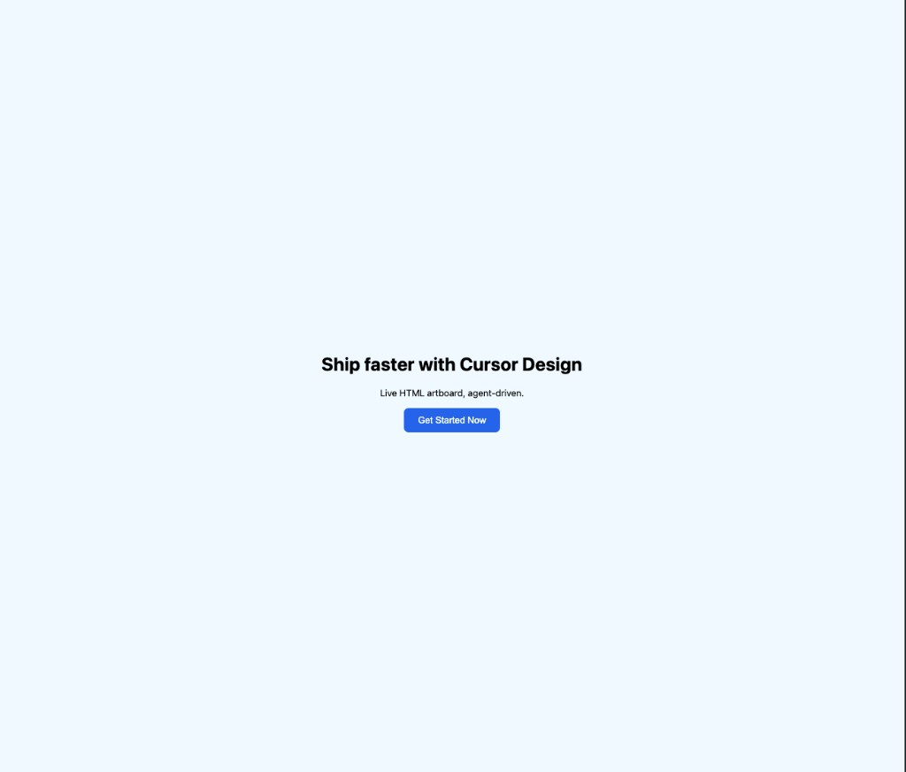

# cursor-design

Agent-driven live HTML artboard for **Cursor** - Claude Design–style canvas without in-panel chat.

- **Panel:** Webview artboard (host chrome + sandboxed HTML iframe)
- **Brain:** Cursor Agent (your subscription) via local MCP + disk under `.cursor-design/`
- **Not:** a Next.js app, Chrome extension, or in-extension LLM calls

## Status

v0.1.0: installable `.vsix` with an artboard panel, seven MCP tools, export handoff + stale badge, and documented v1 limits.



Spec (source of truth): [Notion - Cursor Design](https://app.notion.com/p/3d5500344e0881019a9fd659ccb7ffb4)

## MCP tools

Server name: `cursor-design`. Tools:

- `set_artboard` - create a new artboard id (`html` required; empty string allowed)
- `update_artboard` - replace HTML; requires `baseGeneration` and/or `baseHash`
- `read_artboard` - HTML + meta; `artboardId` optional (defaults to active)
- `list_artboards` - ids on disk (no HTML bodies)
- `set_active_artboard` - switch the active id (does not open the panel)
- `export_artboard` - write `.cursor-design/handoff/<exportId>/` and record `lastExport` (call before implementing)
- `handoff_status` - `{ stale, activeArtboardId, activeHash, lastExport? }`; re-export when `stale` is true

**Allowlist** the server if Cursor prompts. If MCP is denied, edit `.cursor-design/**` on disk and tell the user to allowlist the tools.

## Install

1. From this repo: `pnpm vsix` writes `cursor-design-0.1.0.vsix` at the repo root.
2. In Cursor: Command Palette → **Extensions: Install from VSIX…** → pick that file → reload.
3. Open a trusted folder. Command Palette → **Cursor Design: Open Artboard**.
4. Settings → MCP: allowlist `cursor-design` (toggle off/on if the tool count stays 0; see Limits).

Smoke-tested 2026-09-13, Cursor 3.20.17.

## Develop

```bash
pnpm install
pnpm compile
```

Confirm `dist/mcp.js` exists after compile or the watch/`preLaunchTask` build. F5 will not register a working stdio server without it.

In Cursor: open this folder → **F5** (Run Extension). The Extension Development Host opens `fixtures/dev-workspace` (positional folder arg in `.vscode/launch.json`). The panel does **not** open on startup.

Then in the **Extension Development Host** window (not this repo window):

1. Command Palette → **Cursor Design: Open Artboard** - chrome + disk preview, no CSP errors in the **webview** console.
2. Check MCP: Settings → MCP. Server name `cursor-design`. Activation is `onStartupFinished`, so it registers without opening the panel.
3. Allowlist `cursor-design` (toggle off/on if the tool count stays 0).

Commands:

- **Cursor Design: Open Artboard** - open/reveal the panel
- **Cursor Design: Reveal Design Folder** - reveal `.cursor-design/` if it exists (does not create it)
- **Cursor Design: Export Handoff** - export the active artboard to `.cursor-design/handoff/<exportId>/`

Output: **View → Output → Cursor Design**.

Agent entry: [`AGENTS.md`](./AGENTS.md)

Workflow overlay: [AI Blueprint](https://github.com/aiblueprinthq/ai-blueprint) (plans and review gates, not the product stack).

## Export to implement trial

F5 in the Extension Development Host with `fixtures/dev-workspace` open:

1. Command Palette → **Cursor Design: Open Artboard**. No handoff badge.
2. Design a hero + CTA on the active artboard via Cursor Agent (`set_artboard` / `update_artboard`).
3. Call `export_artboard` (or Command Palette → **Cursor Design: Export Handoff**). Confirm `.cursor-design/handoff/<exportId>/{index.html,IMPLEMENT.md,tokens.json}` and `manifest.json` `lastExport`. Badge still hidden.
4. In a second Agent session, open `.cursor-design/handoff/<exportId>/IMPLEMENT.md` (from `manifest.json.lastExport.exportId`) and implement into `fixtures/dev-workspace/sample-app/index.html`. Do not copy `.cursor-design/` into the app.
5. Edit `artboards/<id>.html` and save. Within ~200ms the panel badge shows `Handoff out of date. Re-export.`
6. Re-export. Badge clears. The previous handoff directory stays on disk.

Then `cd fixtures/dev-workspace/sample-app && pnpm install --ignore-workspace && pnpm dev` to view the implemented page. (`--ignore-workspace` is required because this repo has a root `pnpm-workspace.yaml`; without it, `pnpm install` no-ops and `vite` is missing.) Observed 2026-09-12: Vite 8.3.0 served `index.html` at `http://localhost:5173/` (`Implement the exported artboard here.`).

**Trial performed:** 2026-09-12 (live F5 pass, steps 2–6 green; 6 handoffs on disk, `stale:false`, Vite 200 with latest implement).

## Limits (v1)

Facts, not a roadmap. Drift vs the rules or overview is labeled.

- Cursor only: MCP registration uses `vscode.cursor.mcp.registerServer`. In plain VS Code the server is not registered (warning in Output → Cursor Design); the panel still renders `.cursor-design/` from disk, with no Agent loop.
- First workspace folder only; multi-root beyond the first folder is ignored (`revealDesignFolder.ts`, `handleOpenArtboard.ts` ponytail).
- Untrusted workspaces unsupported (`capabilities.untrustedWorkspaces.supported: false`); artboard HTML is executable workspace content.
- One active artboard, no gallery; variants are new ids + `set_active_artboard`.
- Writes: one process-wide MCP queue (recorded drift vs rule 02 "Serialize writes per artboard id"; documented as-is, queue unchanged); host-vs-MCP manifest writes are last-writer-wins; no cross-window lock (`mcpQueue.ts`, `watchArtboardDisk.ts`, `artboardFs.ts` ponytails). Failed multi-file writes leave partial files (no journal/rollback); orphan handoff dirs are never deleted.
- Artboard iframe: `sandbox="allow-scripts"`. CSP blocks inline event handlers, `style=""` attributes, and external subresources in the artboard (`artboardChromeHtml.ts` v1 limit).
- Handoff carries the whole document in `index.html` (no CSS/JS split; recorded Phase 3 lock vs overview "HTML+CSS+JS"); `.cursor-design/assets/` is copied manually; `tokens.json` is passed through without validation.
- Brain is Cursor Agent only: no in-panel chat, no model API keys, no `vscode.lm`.
- Not on the Marketplace; install from `.vsix` (**Extensions: Install from VSIX…**).
- Cursor MCP settings may show **0 tools** until the server is toggled off/on.
- Chrome is vanilla nonce'd script, not the Svelte 5 + Vite chrome named in the overview (recorded drift, not fixed here).

## License

MIT - see [LICENSE](./LICENSE).
