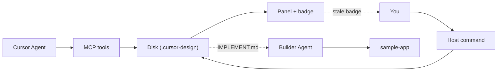
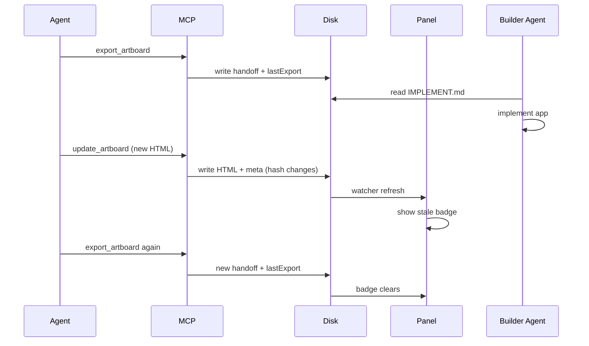
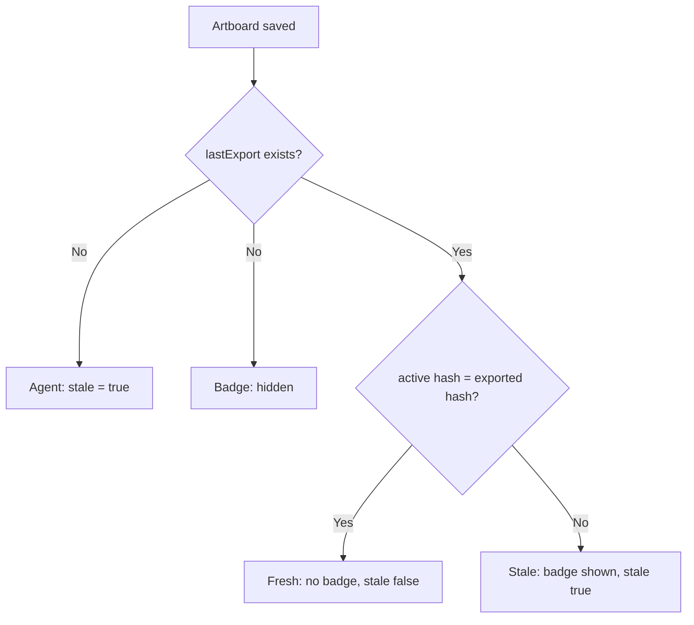

# Phase 3 Export - Overview for review

Source of truth: `blueprint/history/features/04-phase-3-export.md`. This file is the steering summary, not the build spec.

## TL;DR

Phase 3 turns a pretty artboard into a buildable package. Agent (or you) hits Export, we freeze a copy plus instructions, a second Agent builds the real app from it. If the design changes after export, the panel shows "Handoff out of date. Re-export."

## Flow

```
1. Design hero+CTA in panel (Agent writes HTML)
2. Export -> .cursor-design/handoff/<artboardId>-<timestamp>/
   |- index.html (exact copy of the artboard)
   |- IMPLEMENT.md (instructions for the builder Agent)
   |- tokens.json (design tokens, or stub when missing)
3. Builder Agent reads IMPLEMENT.md, implements into sample-app/
4. Edit artboard -> hash changes -> badge appears in panel
5. Re-export -> badge clears, old handoff kept (never deleted)
```

## System map



## Export loop



Same loop for your `Export Handoff` command; the diagram shows the Agent path.

## Stale logic



## Data flow

Export reads 3 things, writes 4 things:

- In: active artboard HTML plus its meta (title, viewport, generation, hash) plus `tokens.json` bytes.
- Out: `handoff/<exportId>/index.html`, `IMPLEMENT.md`, `tokens.json`, plus `manifest.json` updated with `lastExport`.

Concrete example: exporting `hero` now produces `handoff/hero-20260911T173900123Z/`.
`IMPLEMENT.md` carries IDs and hashes only, never the artboard HTML inline; the builder Agent reads `index.html`.
Second-session entry point: `manifest.json` -> `lastExport.exportId` -> that folder's `IMPLEMENT.md`. No list tool.

## What you will see

- Command: `Export Handoff` (works with panel open or closed).
- Badge in panel, only after first export plus a later edit: `Handoff out of date. Re-export.`
- 2 new Agent tools: `export_artboard`, `handoff_status` (total 5 -> 7).

## Architecture decisions

- One pure builder, two writers. The export recipe (IDs, file contents, stale compare) lives in one place with no filesystem access. The Agent path writes via `node:fs`, your command writes via `vscode.workspace.fs` (needed for remote and WSL). Same output either way.
- Disk is truth: `manifest.json` gains one optional field `lastExport` (what plus when plus hash). Schema version stays 1. Every manifest rewrite preserves it.
- Manifest written last. If export crashes halfway, leftover files stay on disk but `lastExport` never points at an incomplete folder. No rollback; orphans are harmless and never deleted.
- Export is a snapshot, not an edit: it never bumps `generation` and never changes which artboard is active.
- Exporting a non-active artboard is allowed but reads stale until that artboard becomes active. The handoff on record must match what the panel shows.
- No new watcher. Export touches `manifest.json`, later saves change the meta hash; the existing ~200ms watcher already flows both to the panel.
- Safe by construction: tool results, badge messages, and `IMPLEMENT.md` never contain absolute paths, stack traces, or artboard HTML. Paths are workspace-relative.

## Decisions locked

- Old handoffs never deleted. No prune, no list tool.
- CSS/JS stays inline in `index.html`. No split into `styles.css` / `main.js`.
- Assets not copied. `IMPLEMENT.md` names the manual copy step.
- Tokens: missing file becomes a stub, present file is byte-copied without parsing.
- Handoff folder holds exactly 3 files and is never removed by the extension.
- Sample app is hand-written Vite plus plain HTML, no scaffolder. Locked DoD stack.
- Panel stays vanilla JS. Svelte rewrite remains recorded drift, not this feature.

## Out of scope

Export or reveal buttons in panel chrome, screenshots, brand checks, style splitting, MIT/README polish beyond the trial section.

## Glossary

| Term | Why it exists |
|---|---|
| `.cursor-design/` | Folder holding all artboard state; the source of truth. |
| `manifest.json` | Index: which artboard is active plus the last export record. |
| `lastExport` | Stamp of the latest export: which artboard, its hash, when. |
| Artboard | One designed page (HTML) previewed in the panel. |
| `.meta.json` | Artboard sidecar: title, viewport, generation, hash. |
| `generation` | Edit counter per artboard; detects conflicting edits. |
| `baseGeneration` | Version the Agent last saw; mismatch means re-read first. |
| `hash` | Fingerprint of the HTML; a change means the design changed. |
| Handoff | Frozen export folder a builder Agent implements from. |
| `exportId` | Handoff name: artboard plus timestamp. |
| `IMPLEMENT.md` | Build instructions for the second Agent session. |
| `tokens.json` | Shared design tokens (colors, spacing). |
| Stale | Design changed after export; re-export to fix. |
| MCP | Tool channel letting the Agent drive the extension. |
| Host | Extension code running inside Cursor. |
| Panel | Preview window showing the artboard. |
| Badge | The "Handoff out of date" flag in the panel. |
| Watcher | File listener refreshing the panel about 200ms after saves. |
| Chrome | Panel frame around the preview (not the browser). |

## Your actions

- Run `pnpm install` once inside `fixtures/dev-workspace/sample-app/` (manual step, Agents do not do it).
- The F5 trial (design, export, implement, edit, badge, re-export) was performed 2026-09-12 and dated in README (steps 2-6 green).

## Done means

Live F5 trial: design hero+CTA via Agent, export, second Agent session implements from `IMPLEMENT.md` into the sample Vite plus plain HTML app, edit artboard, badge shows stale, re-export clears it. Trial date recorded in README before `/complete`.
